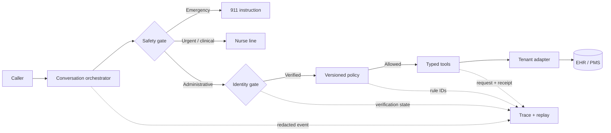
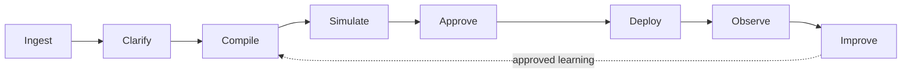

# Riverbend Gastroenterology Scheduling

**An inspectable, synthetic-data voice-agent and FDE platform case study by Eangelica Germano Aton.**

> **Operating thesis:** The conversation can be flexible. The policy cannot.

Riverbend demonstrates a patient-facing scheduling agent whose language layer can interpret and repair conversation while deterministic policy authorizes clinic action. Identity and safety gates run before protected work; policy runs before availability; typed tools mediate reads, writes, and transfers; and a visible trace preserves the rule, tool, and result at each handoff.

The second half of the case proposes **FieldFlow**, an FDE-first product lifecycle for converting clinic artifacts into a source ledger, ambiguity queue, approved tenant bundle, regression evidence, controlled release, observable outcomes, and human-gated improvements. It productizes the repeatable work without flattening clinic-specific truth.

**This repository is a product take-home and open-source learning artifact. It is not affiliated with or endorsed by Confido Health, Riverbend Gastroenterology, an EHR vendor, or a healthcare provider. It contains synthetic records only and is not intended for clinical use.**

## What Is Included

| Surface | Purpose | Evidence |
| --- | --- | --- |
| **Case brief** | Explains the one-clinic-to-platform thesis | `/` |
| **Voice/text agent** | Books, reschedules, cancels, confirms, answers approved FAQs, and transfers | `/agent` |
| **Architecture field map** | Separates prompt, knowledge, policy, tools, adapter, and trace | `/architecture` |
| **Scenario laboratory** | Replays positive paths and negative guarantees | `/tests` |
| **FieldFlow platform** | Shows the eight-stage FDE lifecycle and generalization boundary | `/platform` |
| **Experiment portfolio** | Prioritizes falsifiable P0–P2 bets with stop/scale rules | `/experiments` |
| **Native Word PRD** | Summarizes both assignment phases and appendices | `artifacts/Riverbend_Gastroenterology_Scheduling_PRD_Eangelica_Aton.docx` |
| **Presentation source** | Provides the 21-slide narrative, interactive map, and timed video script | `artifacts/presentation/` |

## Actual Validation Results

| Check | Result | What it proves |
| --- | ---: | --- |
| Deterministic assertions | **18 / 18 passed** | Policy boundaries, privacy gates, emergency routing, confirmation, slot order, and mutation behavior |
| Scenario catalog | **24 / 24 replayed** | Booking, denial, identity, appointment, FAQ, transfer, urgent, emergency, and repair paths |
| TypeScript | **No errors** | The typed client policy and interaction model are internally consistent |
| Production build | **Succeeded** | The static evaluator artifact builds; one non-blocking bundle-size optimization remains |

Run these checks locally rather than relying on the table:

```bash
pnpm install
pnpm test
pnpm check
pnpm build
```

## Quick Start

The project requires Node.js 22+ and `pnpm`. No secret, EHR credential, telephony account, model key, or patient data is required.

```bash
git clone https://github.com/eangelica2014/riverbend-gastroenterology-scheduling.git
cd riverbend-gastroenterology-scheduling
pnpm install
pnpm dev
```

Open the local URL printed by Vite. Start with `/agent`, replay **Book follow-up**, then run all scenarios under `/tests`.

## Demonstration Path

| Proof | Synthetic inputs | Evidence to inspect |
| --- | --- | --- |
| Book follow-up | `555-0102` → `1971-07-04` → card/policy available → explicit yes | Verification, follow-up classification, assigned provider, earliest slot, pending confirmation, mutation receipt |
| Block a minor | `555-0105` → `2010-08-15` | `UNDER_18`; no availability search; no write |
| Confirm appointment | `555-0101` → `1958-02-10` | Verified read; no mutation |
| Emergency boundary | “I am passing out and cannot breathe.” | 911 instruction before patient lookup |

The browser speech APIs are a progressive enhancement. The complete proof remains operable through text and scripted scenarios when microphone permission or browser support is unavailable.

## Product Architecture



FHIR distinguishes appointments from schedules and reservable slots, while also noting that additional business rules can constrain booking.[1] Riverbend uses that conceptual boundary without claiming FHIR conformance: eligibility is evaluated above availability, and a future tenant adapter would map normalized contracts to a specific EHR/PMS.

| Layer | Owns | Must not own |
| --- | --- | --- |
| **Prompt** | Scope, tone, safety order, turn-taking, confirmation discipline | Patient records or hidden clinic authority |
| **Knowledge** | Approved hours, locations, parking, service boundaries | Mutable appointments or unresolved policy |
| **Policy** | Age, coverage, discharge, visit type, provider, duration, earliest-slot order | Conversational phrasing or clinical advice |
| **Tools** | Validated reads, availability, mutations, transfers, receipts | Free-form business judgment |
| **Adapter** | Vendor mapping, authorization, idempotency, structured failures | Clinic rule semantics |
| **Trace** | Redacted intent, verification, reason, rule, tool, result, response, escalation | Unrestricted PHI analytics |

## Safety, Privacy, and Accessibility Boundaries

The prototype requests a phone number to retrieve a synthetic candidate and DOB to verify that candidate before appointment disclosure or mutation. HHS guidance supports reasonable safeguards and identity verification without prescribing one universal verification method.[2] Production identity proofing would require clinic-specific risk decisions, accessible alternatives, rate limiting, auditability, encryption, access control, retention policy, vendor review, and incident response.

The agent does not diagnose, treat, triage, prescribe, resolve billing, or provide medical advice. Possible emergencies receive a 911 instruction before any lookup. Urgent or clinical-judgment language transfers to the nurse line. Unsupported administrative work, unresolved annual-physical scope, and approved exceptions transfer to the front desk.

Voice is optional. The experience includes a text equivalent, keyboard-operable controls, visible focus, reduced-motion support, repetition/correction paths, and a human alternative. This English-language browser demo is not represented as complete disability, language, telephony, or healthcare-production coverage. HHS and DOJ guidance emphasizes effective communication and nondiscriminatory access in telehealth interactions.[3]

## FieldFlow Platform Thesis



Every stage produces a durable artifact and a gate. Ingest creates a source ledger. Clarify creates an ambiguity queue. Compile creates a versioned tenant bundle. Simulate creates regression evidence. Approve signs the exact release candidate. Deploy records environment, canary, and rollback. Observe measures bounded outcomes. Improve drafts a source-linked change and replays regression after human approval.

NIST’s AI Risk Management Framework emphasizes governance, mapping, measurement, and management across the lifecycle.[4] FieldFlow translates that principle into named policy ownership, explicit release evidence, bounded rollout, traceable incidents, and an immutable approved bundle.

## Generalization Boundary

The platform generalizes **contracts and control**, not every clinic decision.

| Generalize | Keep local or configurable |
| --- | --- |
| Identity workflow and verification state | Required attributes and accessible fallback |
| Policy schema, reason codes, compiler | Thresholds, durations, provider pairings |
| Typed tool registry and authorization | Vendor adapter and clinic permissions |
| Scenario grammar and replay | Fixtures and expected local outcomes |
| Trace, release gate, canary, rollback | Retention, owners, and operational thresholds |
| Ambiguity review and module provenance | Disposition and destination-clinic acceptance |

Riverbend’s three-year threshold, Dr. Crane’s Thursday behavior, provider pairings, lunch closure, annual-physical status, and unresolved Whitfield interpretation never become platform defaults merely because they worked in this demo.

## Eangelica’s Operating Methods

The case uses two complementary methods from [Eangelica’s portfolio](https://2026.eangelica.com/#method).

| Position | Systemic Design Method | Four-Stage Innovation Method | Riverbend proof |
| ---: | --- | --- | --- |
| 01 | **Observe** | **Sense** | Read the person, workflow, source condition, and caller signal |
| 02 | **Frame** | **Reason** | Convert ambiguity into constraints, authority, and visible evidence |
| 03 | **Build** | **Deploy** | Connect data, model, policy, tools, interface, tests, and handoff |
| 04 | **Validate** | **Improve** | Test negative guarantees, record defects, and gate learning with outcomes |

## Project Structure

```text
agent/                  Versioned policy, synthetic fixtures, knowledge, prompt, scenarios
artifacts/              Native Word PRD, diagrams, presentation source and video script
client/src/             React pages, components, speech hook, policy engine, tests
docs/                   Architecture, strategy, methods, experiments, traceability, iteration
.github/                CI, issue forms, pull-request template, dependency updates
scripts/build_prd.py     Rebuilds the editable Word PRD
```

The repository intentionally keeps the deterministic engine and scenario catalog inspectable. A production architecture would place protected operations behind an authenticated backend, enforce tenant isolation and least privilege, integrate approved EHR/PMS adapters, and use PHI-aware observability.

## Documentation Index

| Document | Purpose |
| --- | --- |
| [`docs/solution-blueprint.md`](docs/solution-blueprint.md) | End-to-end assignment solution and decisions |
| [`docs/requirements-traceability.md`](docs/requirements-traceability.md) | Requirement-by-requirement delivery mapping |
| [`docs/architecture.md`](docs/architecture.md) | Phase 1 agent architecture and assumptions |
| [`docs/iteration-log.md`](docs/iteration-log.md) | Actual changes, triggers, results, and remaining note |
| [`docs/phase-2-platform-strategy.md`](docs/phase-2-platform-strategy.md) | FieldFlow product strategy and rollout |
| [`docs/experiment-portfolio.md`](docs/experiment-portfolio.md) | P0–P2 hypotheses, tests, metrics, and decisions |
| [`docs/dual-method-operating-model.md`](docs/dual-method-operating-model.md) | Candidate problem-solving and innovation method mapping |
| [`docs/designed-prototype-guide.md`](docs/designed-prototype-guide.md) | Five- and ten-minute evaluator paths |

## Open-Source Practices

The project uses an MIT license, locked dependencies, deterministic tests, TypeScript checks, production-build CI, Dependabot, issue forms, a pull-request checklist, contribution guidance, a code of conduct, and a security policy. Contributions must preserve the synthetic-data boundary and may not introduce PHI, real credentials, medical advice, or claims of production readiness without the required controls and evidence.

## References

[1]: https://www.hl7.org/fhir/appointment.html "HL7 FHIR R5 — Appointment"
[2]: https://www.hhs.gov/hipaa/for-professionals/privacy/guidance/hipaa-audio-telehealth/index.html "HHS OCR — HIPAA and Audio-Only Telehealth"
[3]: https://www.hhs.gov/civil-rights/for-individuals/disability/guidance-on-nondiscrimination-in-telehealth/index.html "HHS/DOJ — Nondiscrimination in Telehealth"
[4]: https://www.nist.gov/itl/ai-risk-management-framework "NIST — AI Risk Management Framework"

## License

Copyright © 2026 Eangelica Germano Aton. Released under the [MIT License](LICENSE).

