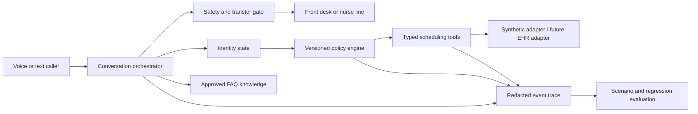

# Phase 1 Architecture and Design Principles

## Architecture Summary

Riverbend uses a **stateful conversational orchestrator around a deterministic administrative core**. Natural language can be ambiguous; appointment mutations cannot be. The model-facing layer identifies intent, manages repair, and communicates the result. A versioned policy engine produces an explicit `PolicyDecision`. Typed tools query or mutate synthetic fixtures only after verification and confirmation gates pass.

## Why This Boundary

The prompt should govern behavior, not become a fragile database. Practice hours and parking are approved knowledge because they are stable read-only facts. Age, insurance, discharge, visit type, provider continuity, Dr. Crane’s Thursday constraint, and earliest-slot selection are deterministic policy because a fluent answer cannot compensate for an unauthorized booking. Patient and appointment state live behind tools because they are mutable and must be verified at read and write boundaries.

HL7 FHIR similarly separates an `Appointment` from `Schedule` and `Slot`; published scheduling guidance notes that a free slot can still require business-rule eligibility before booking.[1] [2] [3] Riverbend therefore searches availability only after policy approval rather than treating a visible time as permission.

## Layer Contracts

| Layer | Input | Output | Failure behavior |
| --- | --- | --- | --- |
| Intent and conversation | Caller utterance plus narrow session state | Supported intent or one repair prompt | Unsupported after one repair transfers to front desk |
| Safety | Current utterance | Continue, nurse transfer, or 911 instruction plus transfer | Stops ordinary workflow immediately |
| Identity | Phone candidate plus caller-provided DOB | Verified patient ID | Reveals no appointment detail on failure |
| Policy | Verified patient, intent, preferences, coverage confirmation | `PolicyDecision` with reason codes and rule IDs | No availability or mutation when denied |
| Availability | Approved visit type, provider, duration, location | Earliest-first eligible slots | Returns typed no-availability result |
| Mutation | Verified patient, confirmed action, valid slot or appointment | Structured receipt | Never converts a conflict into conversational success |
| Trace | Redacted events from every material layer | Replayable decision path | Production design excludes raw secrets and limits PHI visibility |

## Identity and Privacy Decision

The demo starts with phone matching, then requires date-of-birth verification before disclosing appointment details or changing a record. This is a proportional demonstration control, not a universal claim that two factors satisfy every production risk model. HHS requires reasonable safeguards and identity verification when the person is not known, while allowing organizations to choose an appropriate method; accessible and language-meaningful verification remains necessary.[4] Production deployment would add organization-approved verification strength, authenticated tool calls, least privilege, tenant isolation, encrypted transport and storage, PHI-aware logging, retention controls, access review, incident handling, and vendor/BAA review.

## Safety Decision

The assistant handles administrative scheduling only. It does not infer diagnoses or provide medical advice. Urgent clinical questions transfer to the nurse line; a clear possible emergency receives a direct 911 instruction. This aligns the prototype with Confido’s own public boundary that its administrative AI does not diagnose or provide treatment and with a human-escalation design for requests that need clinical judgment.[5]

## Observability

Each material step emits a normalized trace event with turn, state, intent, verification status, policy rule, tool request, structured outcome, latency placeholder, and redaction classification. An FDE can diagnose whether a failure arose in NLU, verification, policy, adapter data, or response rendering without replaying a call blindly. Production instrumentation would map this schema to OpenTelemetry or the company’s existing observability stack.

## Evaluation Strategy

The test suite checks more than final prose. Each scenario can assert required and forbidden tools, rule IDs, mutation count, transfer destination, and final outcome. Critical scenarios include minor, inactive coverage, discharged status, possible emergency, identity failure, and writes before explicit confirmation. Confido’s public testing case study describes generated scenarios, parallel simulations, tool-call assertions, fallback verification, and migration regression testing; Riverbend’s catalog applies the same lifecycle orientation at take-home scale.[6]

## Accessibility and Failure Recovery

Voice is optional enhancement, not the only control. Text input, scripted scenarios, visible focus, keyboard operation, transcript review, reduced-motion behavior, and a direct human-transfer path preserve access when speech recognition is unavailable or inappropriate. Federal guidance emphasizes effective communication in provider availability, scheduling, and appointments and may require alternative methods or additional support.[7] The demo does not claim that an English browser prototype satisfies all disability or language-access obligations; it makes those test dimensions explicit.

## Deployment Boundary

This repository is a synthetic, evaluator-facing prototype. It is not a medical device, production phone system, EHR integration, or HIPAA-compliant service. Production would require security review, adapter conformance and race-condition testing, telephony transfer validation, accessibility testing with users, clinic sign-off, canary traffic, incident thresholds, and rollback.

## References

1. [HL7 FHIR R5 Appointment](https://www.hl7.org/fhir/appointment.html)
2. [HL7 FHIR R4 Schedule](https://hl7.org/fhir/R4/schedule.html)
3. [HL7 FHIR R4 Slot](https://hl7.org/fhir/R4/slot.html)
4. [HHS OCR — Audio-Only Telehealth and HIPAA Guidance](https://www.hhs.gov/hipaa/for-professionals/privacy/guidance/hipaa-audio-telehealth/index.html)
5. [Confido Health — Healthcare AI Receptionist](https://www.confido.health/healthcare-ai-receptionist)
6. [Cekura — How Confido Health Is Safely Scaling AI Voice Agents](https://www.cekura.ai/case-study/confido-health)
7. [HHS and DOJ — Guidance on Nondiscrimination in Telehealth](https://www.hhs.gov/civil-rights/for-individuals/disability/guidance-on-nondiscrimination-in-telehealth/index.html)

